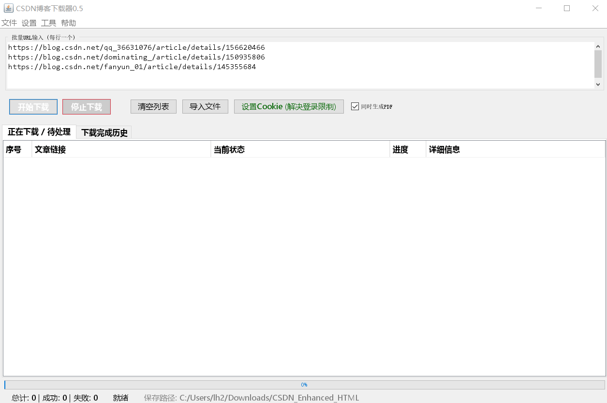
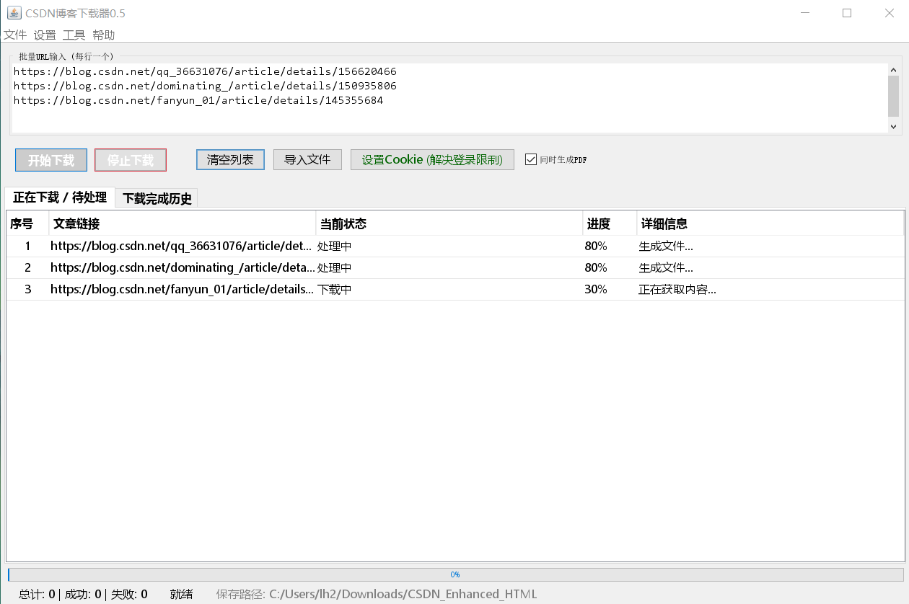
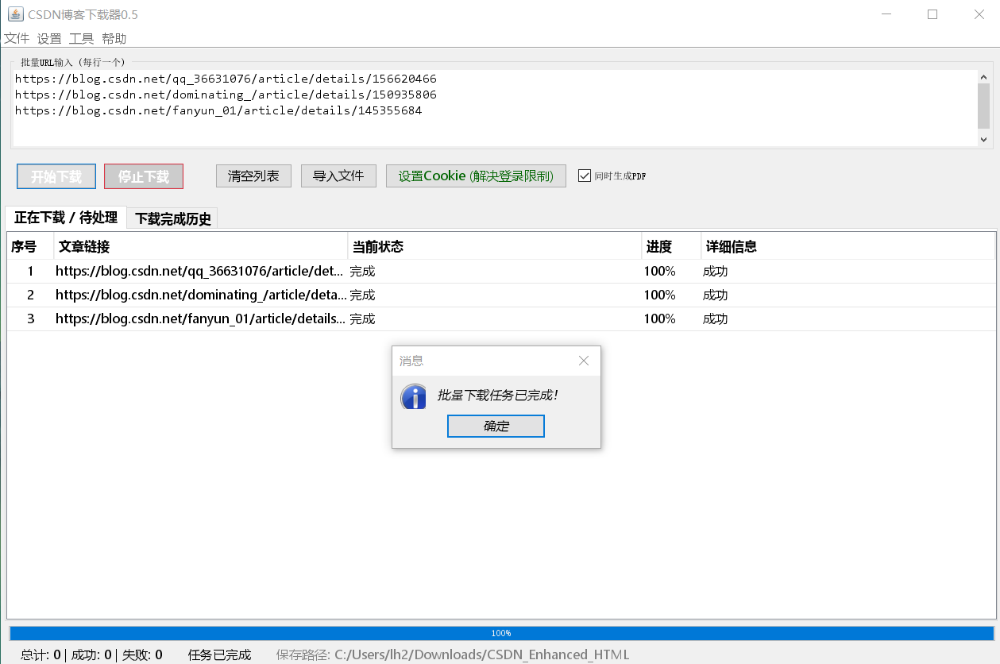

CSDN博客下载器 0.5

核心功能：

• 智能识别：精准识别文章是否存在，支持 404 页面检测

• 健壮性：完整的异常捕获与重试机制

• 格式优化：内置专业版 CSS 样式，PDF 导出排版更精美

• 效率工具：支持批量 URL 导入与 Cookie 自动化加载

• 数据透明：详尽的下载耗时、字符数统计及导出记录

------------------------------------------
截图：
主页

下载中

下载完成

